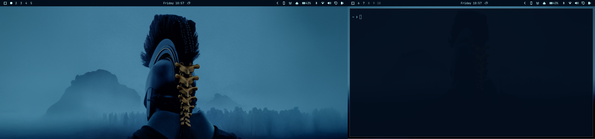

# Multi-Monitor Workspaces



An Omarchy bar widget that assigns workspace indicators across displays:

- **External displays:** workspaces 1–5
- **Built-in laptop display:** workspaces 6–10 when an external display is connected
- **Single-display setup:** workspaces 1–5

The widget shows an occupied or focused state and lets you focus a workspace by clicking its indicator.

## Requirements

- Omarchy with the Quattro shell
- Hyprland

The widget recognizes common built-in-display connector families (`eDP`, `LVDS`, and `DSI`) and does not depend on a particular connector suffix such as `eDP-1`.

## Install

Install and enable using Omarchy's plugin command:

```sh
omarchy plugin add https://github.com/DillanMateusHkl/multi-monitor-workspaces.git --enable
```

After installation, enable **Multi-Monitor Workspaces** in the bar widget settings if it is not already visible.

## Validate

```sh
omarchy plugin validate .
qmllint -I "$OMARCHY_PATH/shell" Workspaces.qml
```

## Behavior

With an external display connected, external displays use workspaces 1–5 and the built-in laptop display uses workspaces 6–10. With one display, the widget shows workspaces 1–5.

## License

[MIT](LICENSE)
